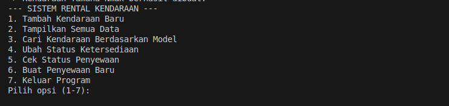
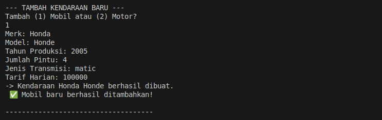
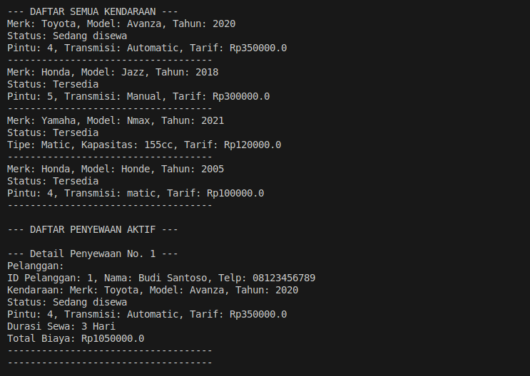
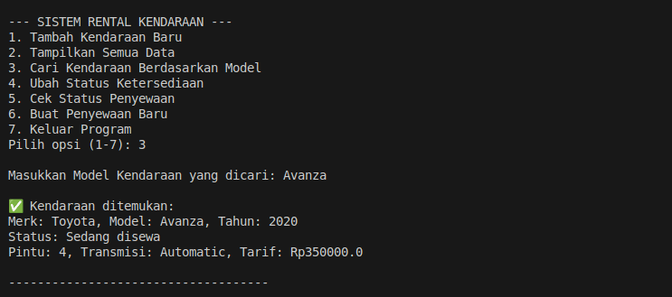
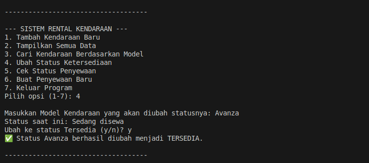
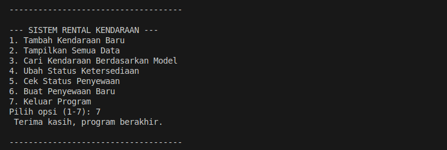

## RENTAL KENDARAAN_UTS
```
Name    : Aldi Alfariz 
NIM     : 24552011212
Kelas   : TIF RP-23 CNS A
```
# 🚗 Aplikasi Rental Kendaraan (OOP Console App)

Aplikasi sederhana untuk manajemen data kendaraan dan transaksi sewa menyewa, diimplementasikan menggunakan bahasa pemrograman Java dengan fokus pada konsep Object-Oriented Programming (OOP), khususnya **Inheritance** (Pewarisan) dan **Polymorphism** (Polimorfisme).

---

## 🏗️ Struktur Proyek

Proyek ini dibangun menggunakan 5 kelas utama yang saling berinteraksi:

1.  **`Kendaraan`** (Superclass/Induk)
2.  **`Mobil`** & **`Motor`** (Subclass/Anak)
3.  **`Pelanggan`** (Data Penyewa)
4.  **`Penyewaan`** (Data Transaksi)
5.  **`Main`** (Program Utama / Main Menu)

### Relasi Kunci (OOP)

* **Inheritance**: `Mobil` dan `Motor` mewarisi properti dan method dari `Kendaraan`.
* **Polymorphism**: Method `tampilkanInfo()` di-override oleh setiap subclass untuk menampilkan detail spesifik. Method *action* (misalnya `nyalakanAC()`, `standarGanda()`) diakses menggunakan *downcasting* pada `Main.java`.

---

## SCREENSHOT 










## 🛠️ Cara Menjalankan

### Persyaratan

Pastikan Anda telah menginstal **Java Development Kit (JDK)** (disarankan Java 11 atau versi lebih baru) di sistem Anda.

### Langkah-Langkah

1.  **Kompilasi File**: Kompilasi semua file `.java` (`Kendaraan.java`, `Mobil.java`, `Motor.java`, `Pelanggan.java`, `Penyewaan.java`, `Main.java`).
    ```bash
    javac *.java
    ```
2.  **Jalankan Program**: Jalankan program dari kelas utama (`Main`).
    ```bash
    java Main
    ```

### Contoh Tampilan Output


